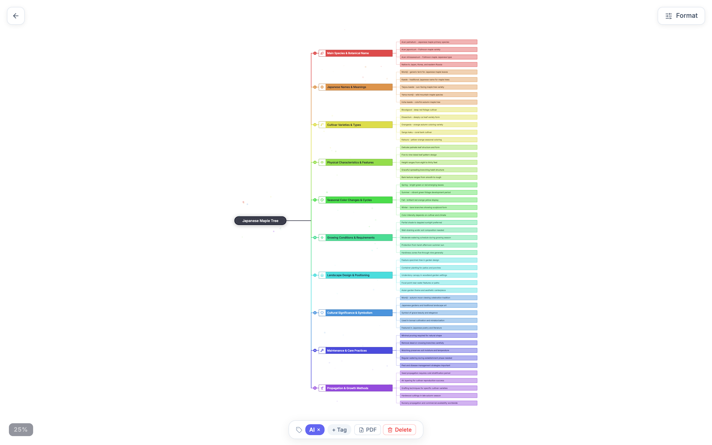
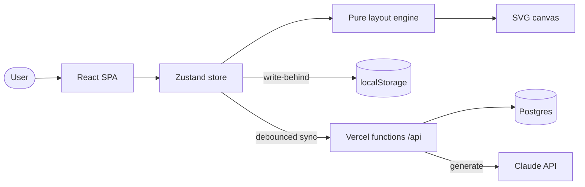
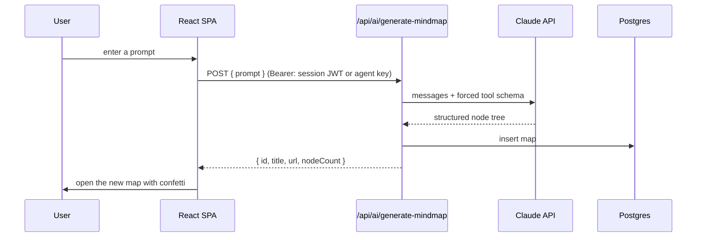

# Mindmaps

A PWA mind-mapping studio where maps are drawn by hand, pasted from an outline, or generated end to end by Claude, then styled, themed, auto-saved, shared as link previews, and exported to PDF.



[](LICENSE)


## Contents

- [Features](#features)
- [Architecture](#architecture)
- [How a map is generated](#how-a-map-is-generated)
- [Design decisions and trade-offs](#design-decisions-and-trade-offs)
- [Tech stack](#tech-stack)
- [Quick start](#quick-start)
- [Configuration](#configuration)
- [Project layout](#project-layout)
- [License](#license)

## Features

- **Five diagram types over one node model** - logic chart, radial mind map, fishbone, timeline, and switchable brace / straight / orthogonal line styles. One click re-lays-out the same nodes into a different shape.
- **AI generation** - describe a topic and Claude returns a full structured map through a forced tool-call schema, auto-assigns an icon to every node, and streams in with a thinking overlay and staggered pop-in.
- **Direct canvas editing** - add / rename / delete / dissolve nodes, drag to reorder with snap guides, multi-select box, 30-step undo/redo, pan and pinch zoom from 2% to 1000%, per-node hyperlinks, and depth-wide resize.
- **Styling and themes** - four themes (Rainbow Light, Retro B&W, Cyberpunk Neon, Monokai), a smooth per-branch colour gradient that inherits down subtrees, bold/italic/align, and an icon / emoji / short-badge picker with search.
- **Home gallery** - list or grid view with a live wireframe per map, YouTube thumbnails when a node links to a video, colored tag pills with filtering, name search, and paste-anywhere import.
- **Sharing and export** - per-map public share links with a read-only viewer, Open Graph link previews with a rendered PNG card, an inline QR code, PDF export, and JSON / URL-embedded import-export.
- **Offline-first persistence** - every map is mirrored to localStorage for instant cache-first load and auto-saved to Postgres on a debounce, with newer-copy-wins conflict resolution.
- **Agent import API** - `POST /api/ai/mindmaps` turns a title plus an indented outline into a saved map, so a shell script or agent can create maps by curl.

## Architecture

A Vite + React single-page app owns one Zustand store as the single source of truth. Every mutation re-derives geometry through a pure layout engine, so node positions are always computed, never hand-maintained. The SPA talks to Vercel serverless functions that persist to Postgres and proxy Claude for generation.



| Layer | Role |
|-------|------|
| `src/store` | One Zustand store: document, selection, UI flags, 30-step undo. Every mutation re-runs layout + colour rebalancing and mirrors to localStorage. |
| `src/lib/layout` | Pure `MindmapNode[] -> MindmapNode[]` engines, one per diagram type. The most testable seam in the app. |
| `src/components/canvas` | SVG renderer: pan/zoom via a direct DOM transform, node drag/edit/resize, edge line styles. |
| `src/hooks` | `useDiagram` persistence facade (localStorage-first, API sync, legacy-type healing) and keyboard shortcuts. |
| `api/` | Vercel functions: owner-scoped Postgres CRUD, `/api/auth` login, Open Graph image rendering, and Claude generation behind a signed-JWT / bearer gate. |

## How a map is generated



## Design decisions and trade-offs

| Decision | Chosen | Alternative | Why this trade-off | Cost we accept |
|----------|--------|-------------|--------------------|----------------|
| State | One Zustand store, layout re-derived on every change | Store positions in the DB | Layout stays consistent and testable; no drift between data and geometry | Recompute cost on large maps |
| Layout | Pure functions per diagram type | One parameterised layout | Each shape is isolated and unit-tested in isolation | Some duplicated measurement helpers |
| Persistence | localStorage-first, debounced server sync | Server as source of truth | Instant load and offline editing | Last-write-wins can lose a concurrent edit |
| AI output | Forced tool-call JSON schema | Parse free-form text | Structure is guaranteed, not hoped for | Tied to a tool-capable model |
| Rendering | Hand-written SVG | A graph library | Full control of look, drag, and export | More rendering code to own |

## Tech stack

- **Frontend** - React 19, TypeScript (strict), Vite 7, Tailwind 4, Zustand
- **Backend** - Vercel serverless functions, `pg` to PostgreSQL, Claude API for generation, Sharp for OG images
- **PWA** - vite-plugin-pwa (installable, NetworkFirst navigation, auto-updating service worker)
- **Testing** - Vitest (731 unit tests) and Playwright end-to-end specs

## Quick start

```bash
git clone https://github.com/bunlongheng/mindmaps.git
cd mindmaps
npm install
npm run dev
```

Open http://localhost:5173. The dev server proxies `/api` to a deployed backend, so generation and sync work without running the functions locally. Run `npm test` for the unit suite and `npm run test:e2e` for the Playwright suite.

## Configuration

Client variables go in `.env` (Vite reads `VITE_`-prefixed vars); server variables are set in the hosting platform for the `api/` functions.

| Env var | Scope | Purpose |
|---------|-------|---------|
| `VITE_SUPABASE_URL` | client | Supabase project URL for realtime notifications |
| `VITE_SUPABASE_ANON_KEY` | client | Supabase anon key (public by design) |
| `DATABASE_URL` | server | PostgreSQL connection string for map storage |
| `DATABASE_CA_CERT` | server | PEM CA cert to verify the DB's TLS (blank = skip verify, dev only) |
| `ANTHROPIC_API_KEY` | server | Claude API key for AI generation |
| `MINDMAP_AI_API_KEY` | server | Bearer key gating the external agent import API (not the CRUD API) |
| `MINDMAP_APP_URL` | server | Base URL used in returned map links (defaults to the prod host) |
| `MINDMAP_JWT_SECRET` | server | HMAC secret used to sign/verify session tokens |
| `MINDMAP_AUTH_EMAIL` | server | Login email |
| `MINDMAP_AUTH_PASSWORD_HASH` | server | SHA-256 hex of the login password (never the plaintext) |
| `MINDMAP_USER_ID` | server | Owner id embedded in the session token |
| `SUPABASE_SERVICE_ROLE_KEY` | server | Server-only; used by `/api/notify` realtime broadcast |

### Auth model

`POST /api/auth` checks the email + SHA-256 password hash from env and issues a 30-day HMAC-SHA256 session token. The CRUD API (`/api/mindmaps`) requires that token and scopes every write to the owner; a public map (`sharing_enabled`) is readable by id without one. The AI/import endpoints (`/api/ai/*`, `/api/notify`) accept either the session token or the static `MINDMAP_AI_API_KEY` (for external agents) - the static key does **not** work on the CRUD API.

## Project layout

```
mindmaps/
├── api/                    # Vercel serverless functions
│   ├── _lib/               # shared: JWT auth, pg pool, CORS
│   ├── ai/                 # Claude generation + agent import
│   ├── auth.ts             # login -> signed session token
│   ├── mindmaps.ts         # owner-scoped Postgres CRUD
│   ├── notify.ts           # realtime toast broadcast
│   └── og*.ts              # Open Graph link previews
├── src/
│   ├── store/              # Zustand store (single source of truth)
│   ├── lib/
│   │   ├── layout/         # pure layout engine, one file per diagram type
│   │   └── export/         # PDF, JSON, share-link export
│   ├── components/
│   │   ├── canvas/         # SVG renderer (nodes, edges, pan/zoom)
│   │   ├── home/           # gallery, tags, thumbnails
│   │   └── panels/         # style + share side panel
│   └── hooks/              # persistence facade, keyboard shortcuts
├── supabase/migrations/    # SQL migrations
├── e2e/                    # Playwright specs
└── scripts/                # icon generation, prod smoke test
```

## License

[MIT](LICENSE) (c) Bunlong Heng
