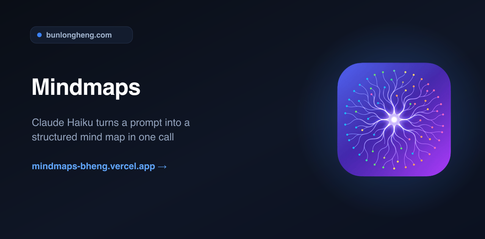
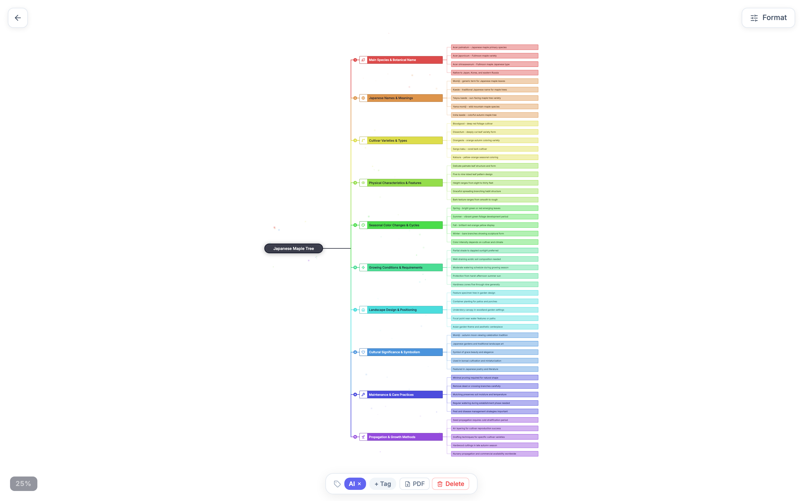
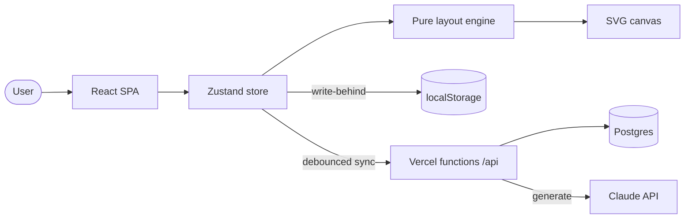
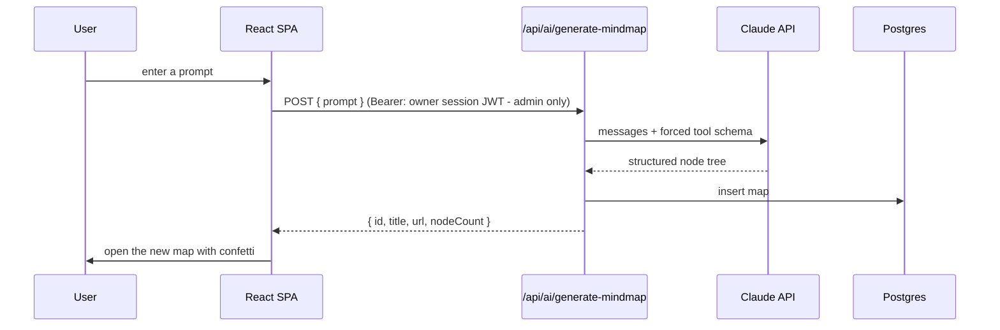

<div align="center">
  
  <h1>Mindmaps</h1>
  <p><em>Claude Haiku turns a prompt into a structured mind map in one call</em></p>
  <p><a href="https://mindmaps-bheng.vercel.app">Live</a> &middot; <a href="https://github.com/bunlongheng/mindmaps">Repo</a> &middot; <a href="https://bunlongheng.com/projects?name=mindmaps">Portfolio</a></p>
  
</div>

---

# Mindmaps

A PWA mind-mapping studio where maps are drawn by hand, pasted from an outline, or generated end to end by Claude, then styled, themed, auto-saved, shared as link previews, and exported to PDF.



[](LICENSE)


## Contents

- [Features](#features)
- [Architecture](#architecture)
- [How a map is generated](#how-a-map-is-generated)
- [Design decisions and trade-offs](#design-decisions-and-trade-offs)
- [Tech stack](#tech-stack)
- [Quick start](#quick-start)
- [Configuration](#configuration)
- [Project layout](#project-layout)
- [License](#license)

## Features

- **Five diagram types over one node model** - logic chart, radial mind map, fishbone, timeline, and switchable brace / straight / orthogonal line styles. One click re-lays-out the same nodes into a different shape.
- **AI generation** - describe a topic and Claude returns a full structured map through a forced tool-call schema, auto-assigns an icon to every node, and streams in with a thinking overlay and staggered pop-in.
- **Direct canvas editing** - add / rename / delete / dissolve nodes, drag to reorder with snap guides, multi-select box, 30-step undo/redo, pan and pinch zoom from 2% to 1000%, per-node hyperlinks, and depth-wide resize.
- **Styling and themes** - four themes (Rainbow Light, Retro B&W, Cyberpunk Neon, Monokai), a smooth per-branch colour gradient that inherits down subtrees, bold/italic/align, and an icon / emoji / short-badge picker with search.
- **Home gallery** - list or grid view with a live wireframe per map, YouTube thumbnails when a node links to a video, colored tag pills with filtering, name search, and paste-anywhere import.
- **Sharing and export** - per-map public share links with a read-only viewer, Open Graph link previews with a rendered PNG card, an inline QR code, PDF export, and JSON / URL-embedded import-export.
- **Offline-first persistence** - every map is mirrored to localStorage for instant cache-first load and auto-saved to Postgres on a debounce, with newer-copy-wins conflict resolution.
- **Agent import API** - `POST /api/ai/mindmaps` turns a title plus an indented outline into a saved map, so a shell script or agent can create maps by curl.

## Architecture

A Vite + React single-page app owns one Zustand store as the single source of truth. Every mutation re-derives geometry through a pure layout engine, so node positions are always computed, never hand-maintained. The SPA talks to Vercel serverless functions that persist to Postgres and proxy Claude for generation.


```mermaid
flowchart LR
    User([User]) --> UI[React SPA]
    UI --> Store[Zustand store]
    Store --> Layout[Pure layout engine]
    Layout --> Canvas[SVG canvas]
    Store -->|write-behind| LS[(localStorage)]
    Store -->|debounced sync| API[Vercel functions /api]
    API --> PG[(Postgres)]
    API -->|generate| Claude[Claude API]
```

| Layer | Role |
|-------|------|
| `src/store` | One Zustand store: document, selection, UI flags, 30-step undo. Every mutation re-runs layout + colour rebalancing and mirrors to localStorage. |
| `src/lib/layout` | Pure `MindmapNode[] -> MindmapNode[]` engines, one per diagram type. The most testable seam in the app. |
| `src/components/canvas` | SVG renderer: pan/zoom via a direct DOM transform, node drag/edit/resize, edge line styles. |
| `src/hooks` | `useDiagram` persistence facade (localStorage-first, API sync, legacy-type healing) and keyboard shortcuts. |
| `api/` | Vercel functions: owner-scoped Postgres CRUD, `/api/auth` login, Open Graph image rendering, and Claude generation behind a signed-JWT / bearer gate. |

## How a map is generated


```mermaid
sequenceDiagram
    participant U as User
    participant C as React SPA
    participant F as /api/ai/generate-mindmap
    participant A as Claude API
    participant DB as Postgres
    U->>C: enter a prompt
    C->>F: POST { prompt } (Bearer: owner session JWT - admin only)
    F->>A: messages + forced tool schema
    A-->>F: structured node tree
    F->>DB: insert map
    F-->>C: { id, title, url, nodeCount }
    C->>U: open the new map with confetti
```

## AI / Agent API

There is **exactly one** published way for an external agent to create a map, and it is
**render-only** (it never calls a model, so it spends **zero** Anthropic credits):

```
POST https://mindmaps-bheng.vercel.app/api/ai/mindmaps
Authorization: Bearer $MINDMAP_AI_API_KEY
Content-Type: application/json

{ "title": "My Map",
  "type": "logic-chart",
  "outline": "{\"Root\":[{\"icon\":\"rocket\",\"Category A\":[\"item 1\",\"item 2\"]}]}" }
```

Response `201`: `{ "id": "...", "url": "https://.../?id=...", "nodeCount": N }`. Bad input
returns a `400` with a sample request; a bad/missing key returns `401` (no row created).
The caller supplies the finished structure (the `outline` is indented text **or** a JSON
string, auto-detected); we render it, we do not think for them.

Everything else is **internal / admin-only**:

| Endpoint | Who | Notes |
|---|---|---|
| `POST /api/ai/mindmaps` | Bearer key **or** owner session | **The one public contract.** Render-only, no AI spend |
| `POST /api/ai/generate-mindmap` | **owner session only** | Calls Claude. The Bearer key is **rejected** (`allowBearer:false`) so public callers can never spend Anthropic $ |
| `GET/POST/PUT/DELETE /api/mindmaps` | signed owner session **or** Bearer key | First-party CRUD; the static key mints an owner-scoped identity, so it passes both reads and writes |
| `GET /api/health` | public, no auth | Readiness probe: 200 only when required env is present and the DB responds, 503 otherwise |
| `GET /api/og`, `GET /api/og-image` | public, no auth | Renders the Open Graph share-card image for a map link preview |

Auth is centralized in `api/_lib/authorizeOwner.ts` (local-dev bypass, gated off in prod →
static Bearer key via constant-time compare → owner-email session JWT).

## Design decisions and trade-offs

| Decision | Chosen | Alternative | Why this trade-off | Cost we accept |
|----------|--------|-------------|--------------------|----------------|
| State | One Zustand store, layout re-derived on every change | Store positions in the DB | Layout stays consistent and testable; no drift between data and geometry | Recompute cost on large maps |
| Layout | Pure functions per diagram type | One parameterised layout | Each shape is isolated and unit-tested in isolation | Some duplicated measurement helpers |
| Persistence | localStorage-first, debounced server sync | Server as source of truth | Instant load and offline editing | Last-write-wins can lose a concurrent edit |
| AI output | Forced tool-call JSON schema | Parse free-form text | Structure is guaranteed, not hoped for | Tied to a tool-capable model |
| Rendering | Hand-written SVG | A graph library | Full control of look, drag, and export | More rendering code to own |

## Tech stack

- **Frontend** - React 19, TypeScript (strict), Vite 7, Tailwind 4, Zustand
- **Backend** - Vercel serverless functions, `pg` to PostgreSQL, Claude API for generation, Sharp for OG images
- **PWA** - vite-plugin-pwa (installable, NetworkFirst navigation, auto-updating service worker)
- **Testing** - Vitest (800+ unit tests) and Playwright end-to-end specs

## Quick start

```bash
git clone https://github.com/bunlongheng/mindmaps.git
cd mindmaps
npm install
npm run dev
```

Open http://localhost:5173. The dev server proxies `/api` to a deployed backend, so generation and sync work without running the functions locally. Run `npm test` for the unit suite and `npm run test:e2e` for the Playwright suite.

## Configuration

Client variables go in `.env` (Vite reads `VITE_`-prefixed vars); server variables are set in the hosting platform for the `api/` functions.

| Env var | Scope | Purpose |
|---------|-------|---------|
| `VITE_GOOGLE_CLIENT_ID` | client | Google OAuth client ID; renders the "Continue with Google" button (Google Identity Services) |
| `GOOGLE_CLIENT_ID` | server | Audience the Google ID token must match when `/api/auth` verifies a sign-in |
| `DATABASE_URL` | server | PostgreSQL connection string for map storage |
| `DATABASE_CA_CERT` | server | PEM CA cert to verify the DB's TLS (blank = skip verify, dev only) |
| `ANTHROPIC_API_KEY` | server | Claude API key for AI generation |
| `MINDMAP_AI_API_KEY` | server | Bearer key gating the external agent import API (not the CRUD API) |
| `MINDMAP_APP_URL` | server | Base URL used in returned map links, and also the CORS allow-origin (defaults to the prod host) - required if self-hosting on a different domain |
| `MINDMAP_JWT_SECRET` | server | HMAC secret used to sign/verify session tokens |
| `MINDMAP_AUTH_EMAIL` | server | Owner email that a Google sign-in must match |
| `MINDMAP_USER_ID` | server | Owner id embedded in the session token |
| `MINDMAP_TOKEN_MIN_IAT` | server | Optional; set to a unix timestamp to instantly revoke all outstanding sessions issued before it |
| `MINDMAP_SMOKE_SAMPLE` | scripts | Optional; how many maps `scripts/smoke-prod.mjs` samples per run (default 8) |
| `LOCAL_DEV` | server, dev-only | Optional; set to `true` to force the local auth bypass when running with `NODE_ENV=production` locally. Never set in Vercel - prod hard-disables the bypass regardless of this var |

### Auth model

Sign-in is pure Google Identity Services - no password, no third-party broker. The client
gets a Google ID token from the "Continue with Google" button and posts it to `POST
/api/auth`, which is rate-limited to 10 attempts per 15 minutes per IP. The server confirms
the token with Google's `tokeninfo` endpoint (signature + expiry), checks that its audience
matches `GOOGLE_CLIENT_ID`, and that its email matches `MINDMAP_AUTH_EMAIL`, then issues a
24-hour HMAC-SHA256 session token (set `MINDMAP_TOKEN_MIN_IAT` to instantly revoke every
outstanding session).

The CRUD API (`/api/mindmaps`) requires that token *or* the static `MINDMAP_AI_API_KEY` -
the static key is an owner-scoped service credential and passes both reads and writes there.
The render-only import endpoint (`/api/ai/mindmaps`) also accepts the static key or the
session token. Generation (`/api/ai/generate-mindmap`), which spends Anthropic credits, is
owner-session only - the static key is explicitly rejected (`allowBearer:false`) so no
external caller can trigger a model call.

### Database migrations

`db/migrations/*.sql` is tracked in a `schema_migrations` ledger via `scripts/migrate.mjs` (`npm run migrate -- <status|backfill|up>`), reading `DATABASE_URL`/`DATABASE_CA_CERT` from the environment. On an existing database where these files were already applied by hand, run `backfill` once to seed the ledger without re-executing any SQL (re-running the oldest migration for real would `DROP TABLE ... CASCADE`); after that, `up` applies only new files.

## Project layout

```
mindmaps/
├── api/                    # Vercel serverless functions
│   ├── _lib/               # shared: JWT auth, pg pool, CORS
│   ├── ai/                 # Claude generation + agent import
│   ├── auth.ts             # Google ID token verify -> signed session token
│   ├── mindmaps.ts         # owner-scoped Postgres CRUD
│   ├── health.ts           # readiness probe
│   └── og*.ts              # Open Graph link previews
├── src/
│   ├── store/              # Zustand store (single source of truth)
│   ├── lib/
│   │   ├── layout/         # pure layout engine, one file per diagram type
│   │   └── export/         # PDF, JSON, share-link export
│   ├── components/
│   │   ├── canvas/         # SVG renderer (nodes, edges, pan/zoom)
│   │   ├── home/           # gallery, tags, thumbnails
│   │   └── panels/         # style + share side panel
│   └── hooks/              # persistence facade, keyboard shortcuts
├── db/migrations/          # SQL migrations
├── e2e/                    # Playwright specs
└── scripts/                # icon generation, prod smoke test
```

## License

[MIT](LICENSE) (c) Bunlong Heng

---

<p align="center">
  <sub>Built by <a href="https://bunlongheng.com">Bunlong Heng</a> &middot; <a href="https://bunlongheng.com/projects/mindmaps">See it in my portfolio &rarr;</a></sub>
</p>
