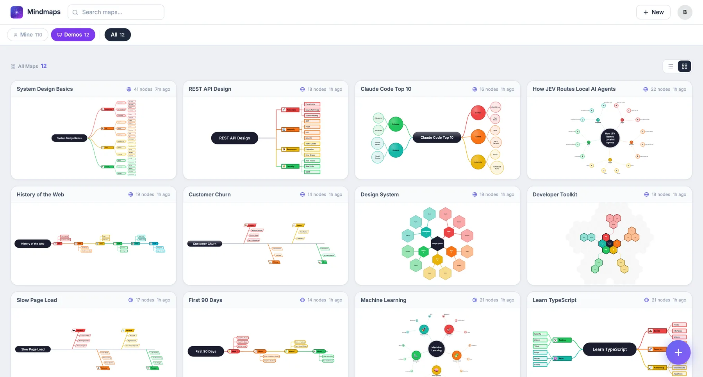

#  Mindmaps

Mind maps an agent can draw and a README can embed.

Give it a title and an outline, get a laid-out map back: 6 diagram shapes over 1 node model, so the same outline is a logic chart, a radial mind map, a graph, a fishbone, a timeline or a honeycomb with 1 click. Every map is a row in Postgres, and the same row renders back out as JSON or a self-contained SVG from a plain URL - so the picture in your docs is the map, not a screenshot of one that drifted 3 commits ago. Plain-English generation ships inside, owner-only, so nobody else can spend your Anthropic credits.



[](https://github.com/bunlongheng/mindmaps/actions/workflows/ci.yml)


**Live:** [mindmaps-bheng.vercel.app](https://mindmaps-bheng.vercel.app) &middot; **Demo wall:** [/?tab=demo](https://mindmaps-bheng.vercel.app/?tab=demo)

## Features

- **6 shapes, 1 outline** - logic chart, mind map, graph, fishbone, timeline, honeycomb. Switch shape and the same nodes re-lay themselves out.
- **It places itself** - positions are computed by a pure layout engine on every change, never hand-maintained, so data and geometry cannot drift.
- **A map is a URL** - the same row as JSON or SVG. New maps are private until you share them.
- **It looks finished** - 4 themes, 3 line styles, 4 box shapes, per-branch colour gradients, 155 icons and an emoji picker, gloss, mesh or web honeycombs.
- **Built to present** - 30-step undo, snap guides, multi-select, zoom from 2% to 1000%, share link with QR code, Open Graph card, PDF export.
- **Offline first** - every map mirrors to localStorage for an instant open and syncs to Postgres on a debounce. Installable PWA.
- **3 ways in** - the canvas, an HTTP API with a token, or the MCP server. Paste an outline anywhere on the home page and it becomes a map.

## Read this before you clone

This is a working app, not a library. It needs 3 things from you, and 1 more if you want the AI part.

| You provide | Why | Free option |
|---|---|---|
| **Postgres** | Every map is a row here, no SQLite fallback | Neon, Supabase, Railway |
| **Google OAuth** | The only sign-in, 1 owner email | Google Cloud Console |
| **A host** | Vercel serverless functions behind a Vite SPA | Vercel, or localhost |
| **Anthropic key** | Plain-English generation only | optional |

## For agents

1 Bearer-authed POST returns a URL. The outline is indented text or a JSON string, auto-detected; a node may carry `emoji`, `icon` or `shape`, and the root may carry a `rootStyle`. It is render-only: no model is called, so it costs 0 Anthropic credits.

```bash
curl -X POST "$APP/api/ai/mindmaps" \
  -H "Authorization: Bearer $MINDMAP_AI_API_KEY" \
  -H "Content-Type: application/json" \
  -d '{"title":"System Design Basics","type":"logic-chart","lineStyle":"curved","sharing":true,
       "outline":"System Design Basics\n  Requirements\n    Functional\n    Non-functional\n  Data\n    Schema\n    Caching"}'
```

The `201` carries `url`, `svg_url` and `nodeCount`. Once it is shared, the SVG URL is the image - no auth, no browser:

```markdown

```

## Quick start

```bash
git clone https://github.com/bunlongheng/mindmaps.git
cd mindmaps
cp .env.example .env.local         # DATABASE_URL, Google OAuth, MINDMAP_AUTH_EMAIL, MINDMAP_AI_API_KEY
npm install
npm run migrate                    # applies db/migrations to a fresh database
npm run dev                        # http://localhost:5173
```

`npm test` runs 1244 unit tests, `npm run test:e2e` runs 151 Playwright tests. `node scripts/seed-demos.mjs` fills the Demos tab with the 12 showcase maps.

## Configuration

| Env var | Purpose |
|---|---|
| `DATABASE_URL`, `DATABASE_CA_CERT` | Postgres connection. The CA cert verifies TLS on a remote host |
| `VITE_GOOGLE_CLIENT_ID`, `GOOGLE_CLIENT_ID` | Google OAuth client, for the button and for verifying the ID token at `/api/auth` |
| `MINDMAP_AUTH_EMAIL`, `MINDMAP_USER_ID` | The 1 account that can sign in, and the id its maps are stored under |
| `MINDMAP_JWT_SECRET` | Signs the 24-hour session token. `openssl rand -hex 32` |
| `MINDMAP_TOKEN_MIN_IAT` | Optional unix timestamp. Set it to now to revoke every outstanding session |
| `MINDMAP_AI_API_KEY` | Bearer for `POST /api/ai/mindmaps`, the CRUD API and the MCP server. Server-only |
| `ANTHROPIC_API_KEY` | Plain-English generation only. Leave unset to disable it |
| `MINDMAP_APP_URL` | Absolute links in responses and the CORS allow-origin |

`VITE_DEV_USER_*` signs the owner in automatically on localhost and is stripped from the production bundle.

## API

| Route | Auth | Returns |
|---|---|---|
| `POST /api/ai/mindmaps` | Bearer | A new map, with `url`, `svg_url` and `nodeCount`. Render-only |
| `POST /api/ai/generate-mindmap` | Owner session | A new map written by Claude from a prompt. The Bearer key is rejected here |
| `GET /api/mindmaps?id=` | Public if shared | JSON, or `?format=svg` |
| `GET /s/:id` | Public if shared | Share page with Open Graph card |
| `GET /api/health` | Public | 200 when the env is set and the database answers, 503 otherwise |

**MCP.** `mcp/server.mjs` exposes `create_mindmap` and `get_mindmap_schema` over stdio. Register it with your agent and point `MINDMAP_AI_API_KEY` at your deployment. See [mcp/README.md](mcp/README.md).

## Contributing

Issues and pull requests are welcome. Run `npm run lint`, `npm test` and `npm run test:e2e` before opening one.

## License

[MIT](LICENSE) (c) Bunlong Heng

---

<div align="center">

<a href="https://bunlongheng.com"></a>
<a href="https://www.linkedin.com/in/bunlongheng/"></a>
<a href="https://www.instagram.com/ibunlong/"></a>
<a href="mailto:bheng.code@gmail.com"></a>

<br>

Built by **[Bunlong](https://bunlongheng.com)** &nbsp;&middot;&nbsp; [more apps](https://bunlongheng.com/projects)

</div>
